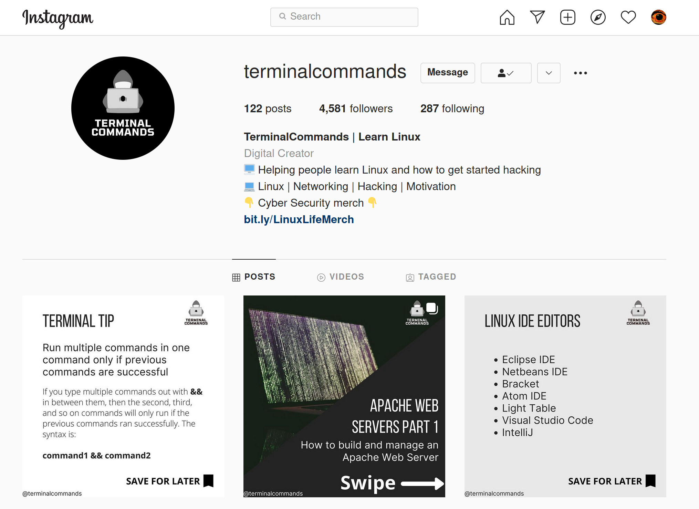
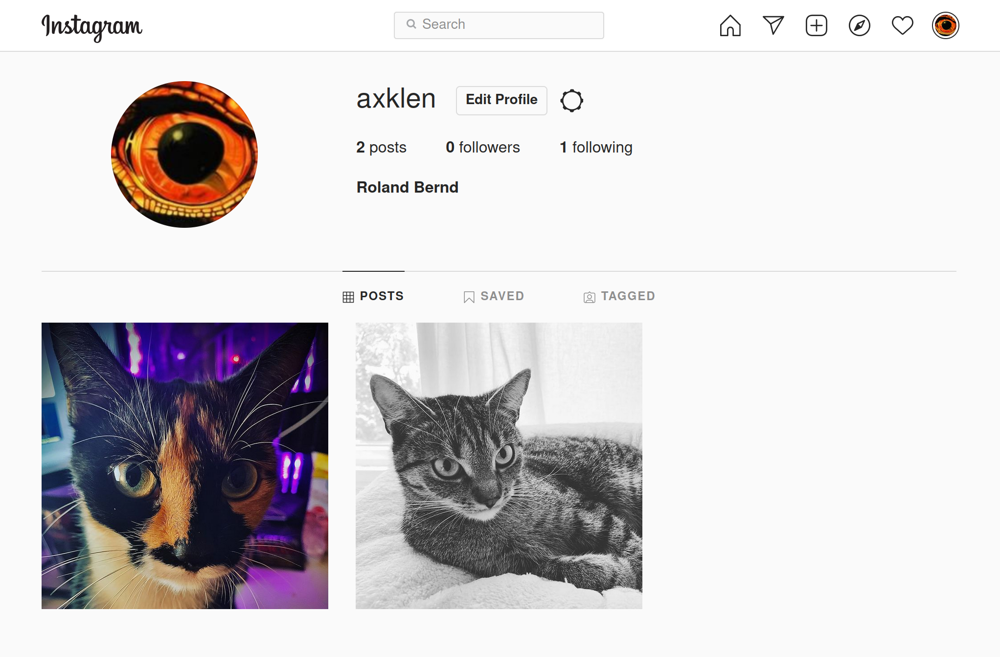
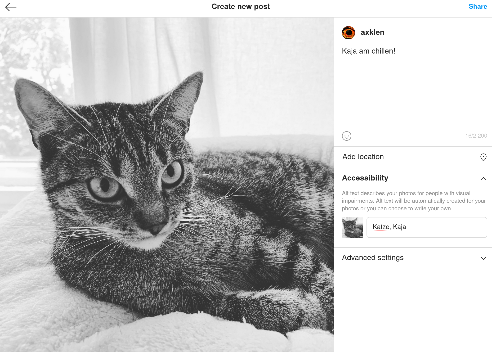
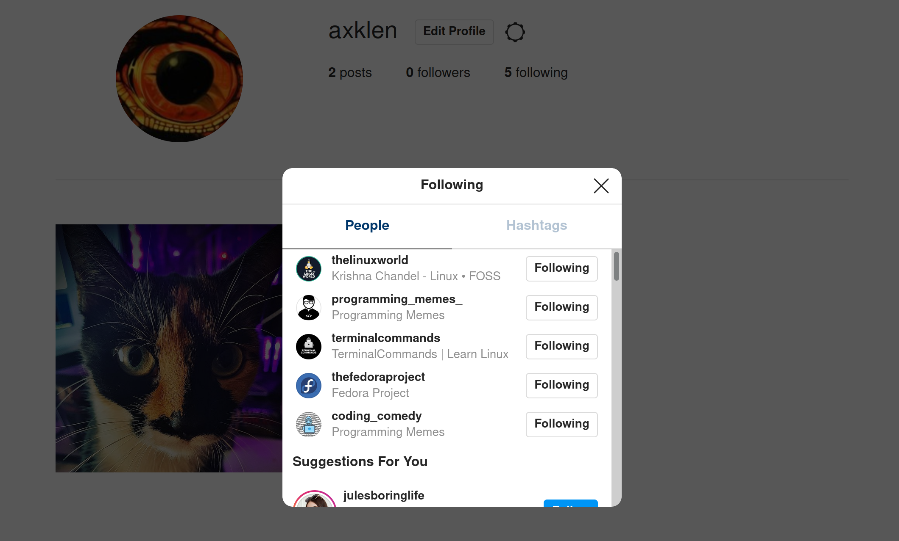
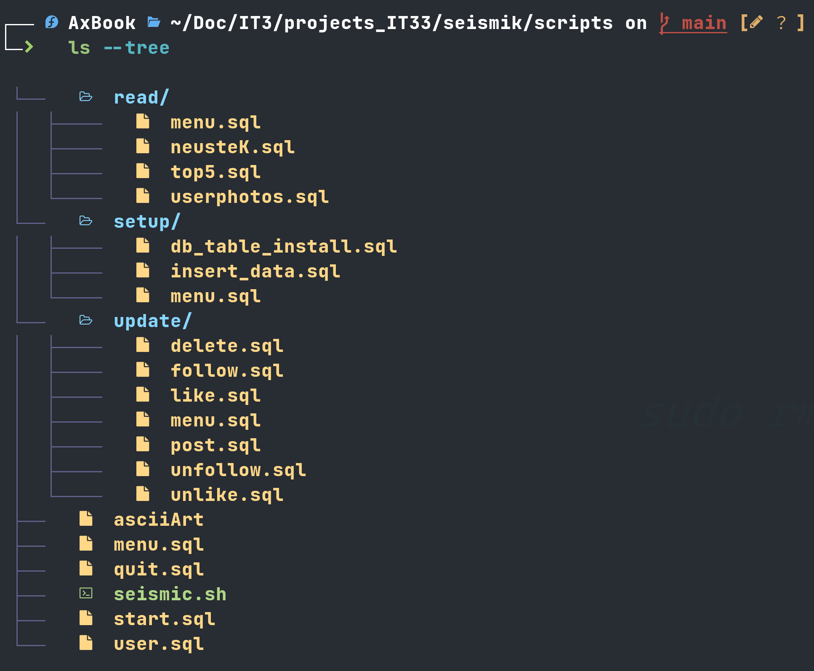
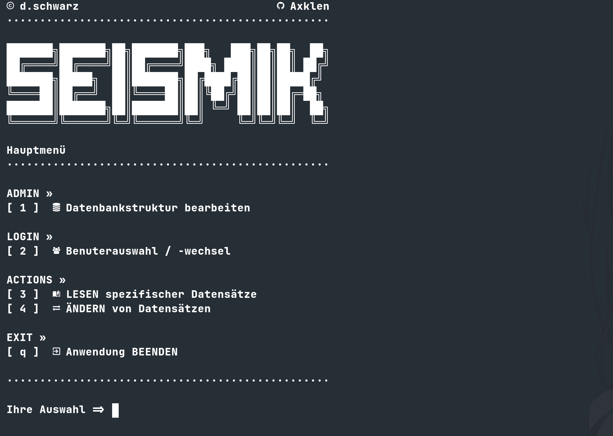
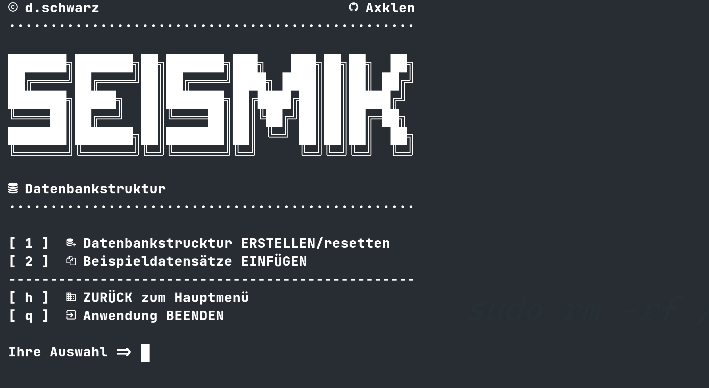
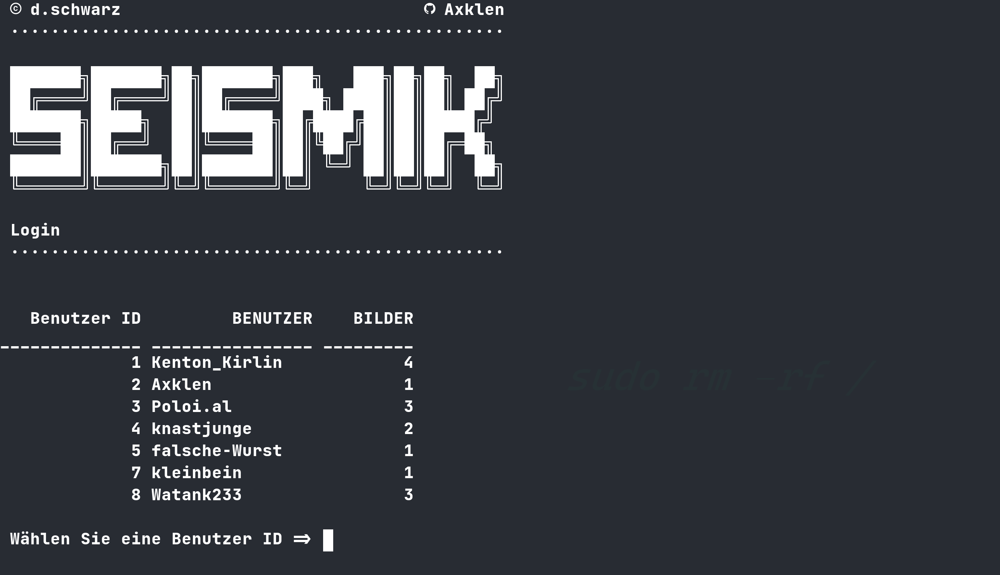
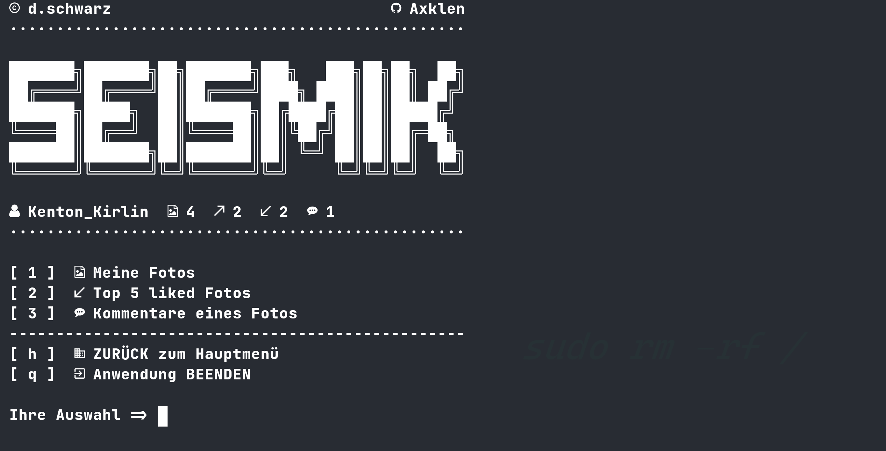
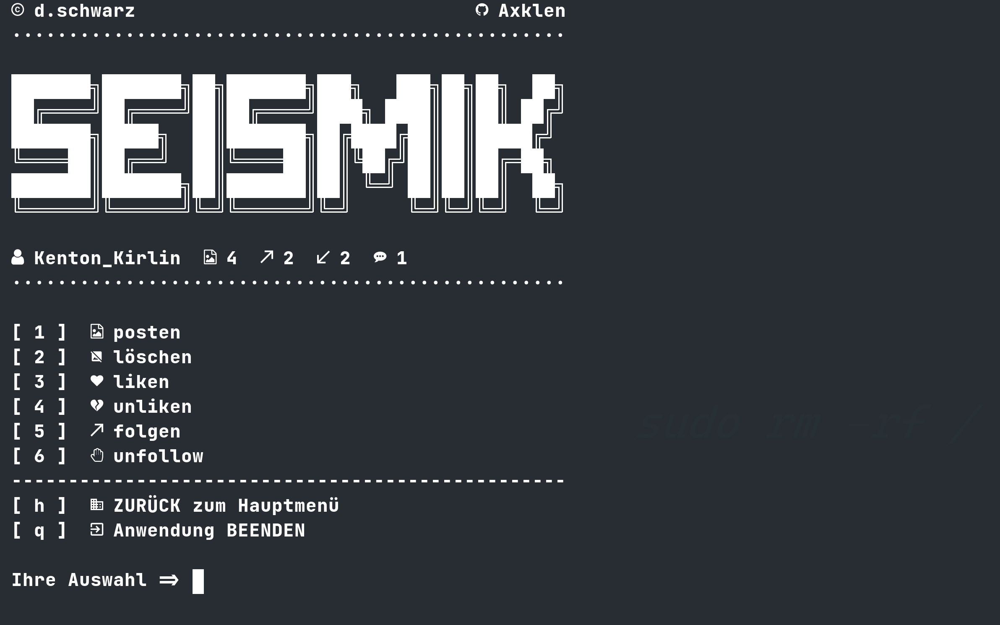

Man kann es sich wie eine Art Online-Fotoalbum vorstellen, in dem man Einblicke
in sein Leben geben kann. Es ist auf allen gängigen Plattformen erhältlich und
wird auch gern von Unternehmen zur Reichweitensteigerung genutzt.

#### Users

Benutzer laden Bilder hoch, die sie durch Tags (Hashtags) kategorisieren können.
Diese Bilder können in Ihrer Größe verändert werden und man kann verschiedene
Farbfilter auf sie Anwenden.

---

**Funktionsübersicht**

- Hochladen von Bildern aus dem Album oder direkte Verknüpfung mit der Kamera des Smartphones oder Tablets
- Hochladen oder Drehen von Videos
- Geotag-Funktion, über die eine eigene Fotokarte eines Nutzers angelegt werden kann
- Austausch über Fotos mit anderen Usern
- Like-Funktion in Form eines Herzes
- Kommentar-Funktion, mit der Möglichkeit Hashtags zu verwenden

#### Posts

#### Tags (und Following)

### Relevante Objekte

Aus der Analyse von Instagram ergeben sich die nachfolgend beschriebenen relevanten
Objekte für unser Projekt SEISMIK.

#### Users

Das sind die Benutzeraccounts zur Identifizierung eines Benutzers.

- Benutzername ist unique und nicht leer (min. 4 Zeichen)
- Passwort ist nicht leer (min. 8 Zeichen)
- beim erstellen des Benutzers wird ein Timestamp erstellt

| **id**              | Eindeutige ID zur internen Identifizierung der User                   |
| ------------------- | --------------------------------------------------------------------- |
| Wertebereich        | Ganze Zahlen                                                          |
| Werte-Einschränkung | Nein                                                                  |
| Wertevergabe        | System / Auto_Incement                                                |
| Default-Wert        | Nein                                                                  |
| NULL-Wert-erlaubt   | Nein                                                                  |
| Duplikate erlaubt   | Nein                                                                  |
| Primärschlüssel     | Ja                                                                    |
| Sonst               | automatisch vom System verwaltet über: `GENERATED ALWAYS AS IDENTITY` |
| Beispielwerte       | 1, 2, 3, ...                                                          |
: Users.id

| **username**        | Eindeutiger vom Benutzer gewählter Identifier, Unique und min. 4 Zeichen |
| ------------------- | ------------------------------------------------------------------------ |
| Wertebereich        | Text                                                                     |
| Werte-Einschränkung | min. 4 Zeichen                                                           |
| Wertevergabe        | Benutzereingabe                                                          |
| Default-Wert        | Nein                                                                     |
| NULL-Wert-erlaubt   | Nein                                                                     |
| Duplikate erlaubt   | Nein                                                                     |
| Primärschlüssel     | Nein                                                                     |
| Sonst               | -                                                                        |
| Beispielwerte       | 'Roland', '11KidShredder', 'user.dummy'                                  |
: Users.username

| **passwd**          | vom Benutzer gewähltes Passwort (gehashed in SHA2), min. 8 Zeichen |
| ------------------- | ------------------------------------------------------------------ |
| Wertebereich        | Text                                                               |
| Werte-Einschränkung | min. 8 Zeichen                                                     |
| Wertevergabe        | Benutzereingabe                                                    |
| Default-Wert        | Nein                                                               |
| NULL-Wert-erlaubt   | Nein                                                               |
| Duplikate erlaubt   | Ja                                                                 |
| Primärschlüssel     | Nein                                                               |
| Sonst               | -                                                                  |
| Beispielwerte       | '12345678', '12fdfs2e123', 'sdf-.?. .ddds'                         |
: Users.passwd

| **created_at**      | vom System automatisch erstellter Timestamp bei Account-Erstellung |
| ------------------- | ------------------------------------------------------------------ |
| Wertebereich        | Datum & Zeit                                                       |
| Werte-Einschränkung | Nein                                                               |
| Wertevergabe        | System, bei Erstellung des Accounts                                |
| Default-Wert        | Ja, sysdate                                                        |
| NULL-Wert-erlaubt   | Ja                                                                 |
| Duplikate erlaubt   | Ja                                                                 |
| Primärschlüssel     | Nein                                                               |
| Sonst               | -                                                                  |
| Beispielwerte       | '11.11.2021 23:59:59' ...                                          |
: Users.created_at

#### Photos

Dies sind die Photos die von Usern gepostet werden

- Das Foto wird vorerst als url gespeichert
- beim erstellen des Fotos wird ein Timestamp erstellt

| **id**              | Eindeutige ID zur internen Identifizierung der Fotos                  |
| ------------------- | --------------------------------------------------------------------- |
| Wertebereich        | Ganze Zahlen                                                          |
| Werte-Einschränkung | Nein                                                                  |
| Wertevergabe        | System / Auto_Incement                                                |
| Default-Wert        | Nein                                                                  |
| NULL-Wert-erlaubt   | Nein                                                                  |
| Duplikate erlaubt   | Nein                                                                  |
| Primärschlüssel     | Ja                                                                    |
| Sonst               | automatisch vom System verwaltet über: `GENERATED ALWAYS AS IDENTITY` |
| Beispielwerte       | 1, 2, 3, ...                                                          |
: Photos.id

| **image_url**       | Verlinkt zum geposteten Foto eines Benutzers, später ersetzt durch blob |
| ------------------- | ----------------------------------------------------------------------- |
| Wertebereich        | Text                                                                    |
| Werte-Einschränkung | Nein                                                                    |
| Wertevergabe        | Benutzereingabe                                                         |
| Default-Wert        | Nein                                                                    |
| NULL-Wert-erlaubt   | Nein                                                                    |
| Duplikate erlaubt   | Ja                                                                      |
| Primärschlüssel     | Nein                                                                    |
| Sonst               | -                                                                       |
| Beispielwerte       | 'img/katze.jpg' ...                                                     |
: Photos.image_url

| **created_at**      | vom System automatisch erstellter Timestamp beim upload des Fotos |
| ------------------- | ----------------------------------------------------------------- |
| Wertebereich        | Datum & Zeit                                                      |
| Werte-Einschränkung | Nein                                                              |
| Wertevergabe        | System, bei Erstellung des Accounts                               |
| Default-Wert        | Ja, sysdate                                                       |
| NULL-Wert-erlaubt   | Ja                                                                |
| Duplikate erlaubt   | Ja                                                                |
| Primärschlüssel     | Nein                                                              |
| Sonst               | -                                                                 |
| Beispielwerte       | '11.11.2021 23:59:59' ...                                         |
: Photos.created_at

#### Tags

Jedes Foto kann verschieden Tags zugeordnet werden.

- Tags sind Einzigartig
- beim erstellen des Tags wird ein Timestamp erstellt

| **id**              | Eindeutige ID zur internen Identifizierung der Fotos                  |
| ------------------- | --------------------------------------------------------------------- |
| Wertebereich        | Ganze Zahlen                                                          |
| Werte-Einschränkung | Nein                                                                  |
| Wertevergabe        | System / Auto_Incement                                                |
| Default-Wert        | Nein                                                                  |
| NULL-Wert-erlaubt   | Nein                                                                  |
| Duplikate erlaubt   | Nein                                                                  |
| Primärschlüssel     | Ja                                                                    |
| Sonst               | automatisch vom System verwaltet über: `GENERATED ALWAYS AS IDENTITY` |
| Beispielwerte       | 1, 2, 3, ...                                                          |
: Tags.id

| **tag_name**        | Bezeichner für die verschiedenen Tags der Fotos, vorerst keine Beschränkungen |
| ------------------- | ----------------------------------------------------------------------------- |
| Wertebereich        | Text                                                                          |
| Werte-Einschränkung | Nein                                                                          |
| Wertevergabe        | Benutzereingabe                                                               |
| Default-Wert        | Nein                                                                          |
| NULL-Wert-erlaubt   | Nein                                                                          |
| Duplikate erlaubt   | Nein                                                                          |
| Primärschlüssel     | Nein                                                                          |
| Sonst               | -                                                                             |
| Beispielwerte       | 'cat', 'drachenlordImKnast', 'WM2020' ...                                     |
: Tags.tag_name

| **created_at**      | vom System automatisch erstellter Timestamp bei Erstellung des Tags |
| ------------------- | ------------------------------------------------------------------- |
| Wertebereich        | Datum & Zeit                                                        |
| Werte-Einschränkung | Nein                                                                |
| Wertevergabe        | System, bei Erstellung des Accounts                                 |
| Default-Wert        | Ja, sysdate                                                         |
| NULL-Wert-erlaubt   | Ja                                                                  |
| Duplikate erlaubt   | Ja                                                                  |
| Primärschlüssel     | Nein                                                                |
| Sonst               | -                                                                   |
| Beispielwerte       | '11.11.2021 23:59:59' ...                                           |
: Tags.created_at

### Beziehungen

Aus der Analyse von Instagram ergeben sich die nachfolgend beschriebenen Beziehungen
für unser Projekt SEISMIK.

#### posten

Ist eine Binäre Beziehung zwischen Users und Photos.

- Jeder User kann ein oder mehrere Fotos posten
- Jedes Foto wird von genau einem User gepostet

|        | **Beteiligung**                                | **Kardinalität**                                  |
| ------ | ---------------------------------------------- | ------------------------------------------------- |
| Users  | 0                                              | N                                                 |
|        | Jeder User muss kein Foto posten               | Jeder User kann mehrere Fotos posten              |
| Photos | 1                                              | 1                                                 |
|        | Jedes Foto muss von einem User gepostet werden | Jedes Foto wird von höchstens einem User gepostet |
: Beziehung posten

#### liken

Ist eine Binäre Beziehung zwischen Users und Photos.

- Jeder User kann ein oder mehrere Fotos liken
- Jedes Photo kann von mehreren Usern geliked werden

|        | **Beteiligung**                                     | **Kardinalität**                                 |
| ------ | --------------------------------------------------- | ------------------------------------------------ |
| Users  | 0                                                   | N                                                |
|        | Jeder User muss kein Foto liken                     | Jeder User kann mehrere Fotos liken              |
| Photos | 0                                                   | M                                                |
|        | Jedes Foto muss nicht von einem User geliked werden | Jedes Foto kann von mehreren User geliked werden |
: Beziehung liken

#### comments

Ist eine Binäre Beziehung zwischen Users und Photos.

- Jeder User kann ein oder mehrere Fotos kommentieren
- Jedes Photo kann von mehreren Usern kommentiert werden

|        | **Beteiligung**                        | **Kardinalität**                           |
| ------ | -------------------------------------- | ------------------------------------------ |
| Users  | 0                                      | N                                          |
|        | Jeder User muss kein Foto kommentieren | Jeder User kann mehrere Fotos kommentieren |
| Photos | 0                                      | M                                          |
|        | Jedes Foto muss nicht von einem        | Jedes Foto kann von mehreren               |
|        | User kommentiert werden                | User kommentiert werden                    |
: Beziehung comments

#### photo_tags

Ist eine Binäre Beziehung zwischen Tags und Photos.

- Jeder Tag muss einem oder mehreren Fotos zugeordnet sein
- Jedes Photo kann mit mehreren Tags gekennzeichnet werden

|        | **Beteiligung**                           | **Kardinalität**                              |
| ------ | ----------------------------------------- | --------------------------------------------- |
| Tags   | 1                                         | N                                             |
|        | Jeder Tag muss einem Foto zugeordnet sein | Jeder Tag kann mehreren Fotos zugeordnet sein |
| Photos | 0                                         | M                                             |
|        | Jedes Foto muss nicht mit einem           | Jedes Foto kann mit mehreren                  |
|        | Tag gekennzeichnet werden                 | Tags gekennzeichnet werden                    |
: Beziehung photo_tags

#### follows

Ist eine Unäre Beziehung von Users

- Jeder Follower kann mehreren Followees folgen
- Jeder Followee kann mehrere Follower besitzen

|       | **Beteiligung**                            | **Kardinalität**                              |
| ----- | ------------------------------------------ | --------------------------------------------- |
| Users | 0                                          | N                                             |
|       | Jeder follower muss keinem followee folgen | Jeder follower kann mehreren followees folgen |
| Users | 0                                          | M                                             |
|       | Jeder followee muss keinen follower        | Jeder followee kann von mehreren              |
|       | besitzen                                   | followern gefolgt werden                      |
: Beziehung follows

### Typische Operationen

- Benutzer login
- Anzeige Kommentare eines Fotos
- Ausgabe aller Followees des Benutzers
- Ausgabe der Followers des Benutzers
- Ausgabe aller likes eines Bildes

### weitere relevante Informationen

Im nachfolgend sind weitere relevanten Informationen aufgelistet, die bei der Erstellung der Datenbank
und Auswahl des Datenbanksystems zu beachten sind.

#### Datenmengen

Über das Datenvolumen der Datenbank lässt sich an dieser Stelle noch keine ganz
genaue Aussage treffen. Unter anderem fehlen Informationen, in welchem Format und Auflösung die
Bilder später gespeichert werden und ob auch noch Videos und andere Metadaten hinzu kommen werden.

Es ist allerdings davon auszugehen das das die Datenbank schnell mehrere TB groß
werden kann.

#### Gesetzliche Bestimmungen

Da wir uns im Internet bewegen sind die jeweiligen Rechtsbestimmungen aller Länder
zu beachten. Besonders in Hinsicht auf Datenschutz und möglicher (Anti-) Zensurgesetze.

Wir werden uns in der ersten Phasen nur auf den europäischen Markt konzentrieren
und nehmen die [Europäische Datenschutz-Grundverordnung ](https://www.bmwi.de/Redaktion/DE/Artikel/Digitale-Welt/europaeische-datenschutzgrundverordnung.html) sowie nationale Regelungen als
mindestmaß für unser Konzept.

Zudem sind strafrechtliche Bestimmungen der einzelnen Länder zu beachten.

#### Sicherung der Datenbank

Wir können uns keine Downtimes der Datenbank erlauben, da wir uns auf einem globalen
Markt bewegen.
Die Datenbank wird als micro-service in einem orchestrierten Container-cluster
laufen. Sie wird durch Replizierung gegen einen Ausfall gesichert und jeweils asynchron auf externe
Sicherungshubs verteilt.

#### Zeichensatz

Als Zeichensatz werden wir UTF-8 einsetzen.

## Entity Relationship-Modell

### Gesamtdarstellung

\pagebreak

### Detaildarstellung

Jede Entität wird nachfolgend detailliert mit den dazugehörigen Attributen dargestellt.

#### USERS

#### PHOTOS

#### TAGS

## Relationenmodell

## Normalisierung

An dieser Stelle sollen nur die ersten 3 Normalformen betrachtet werden.

1. Normalform
   Alle Attribute weisen nur atomare Werte auf.

2. Normalform:
   Da die 1. Normalform erfüllt ist und alle Primärschlüssel aus künstlichen
   Schlüsseln gebildet werden, liegt die 2. Normalform vor.

3. Normalform:
   Die 2. Normalform liegt vor und es existieren keine Nichtschlüsselattribute,
   die transitiv vom Primärschlüssel abhängen. Somit ist die 3. Normalform
   ebenfalls gegeben.

## Datenbankobjekte

Zum Erstellen der Datenbankobjekte wird ein Benutzer benötigt, der über ausreichende Rechte verfügt.

### Tabellen

- löschen bereits vorhandener Tabellen
- Erstellung aller vorher aufgelisteten Tabellen von SEISMIK

Script: `setup/db_table_install.sql`

### Dummy-Datensätze

- entfernen aller vorhandenen Datensätzen in allen Tabellen
- einfügen von Dummy-Datensätze in jede Tabelle
- speichern (COMMIT) der Transaktion

Skript: `setup/insert_data.sql`

## Datenmanipulation

Die Manipulation der Daten erfolgt durch interaktive Eingabe der Werte.

### Foto posten

Es wird ein neues Foto (derzeit noch link) des angemeldeten Benutzers (Login) in der Tabelle `photos`
gespeichert. Der Benutzer wird zum Datenupload (derzeit noch url) des Fotos aufgefordert.
Der Primärschlüssel wird vom DBMS selbst verwaltet. Am Ende werden die Änderungen gespeichert (COMMIT)

Skript: `update/post.sql`

### Foto löschen

Es wird ein ausgewähltes Foto (derzeit noch link) des angemeldeten Benutzers(Login) aus der Tabelle `photos` gelöscht.
Der Benutzer wählt die ID des Fotos das er löschen möchte aus.
Dann wird dass Foto in der Tabelle `photos` gelöscht. Anschließend werden in allen
Beziehungen/Tabellen (`likes`, `comments`, `photo_tags`) die jeweiligen zugehörigen Datensätze gelöscht.
Am Ende wird die Transaktion abgeschlossen (COMMIT).

Skript: `update/post.sql`

### Liken

Es werden dem Benutzer alle Fotos die er noch nicht geliked hat angezeigt.
Der eingeloggte Benutzer wählt eine Foto ID aus (`photos`).
Dann wird in der Tabelle `likes` die ID des eingeloggten Benutzers sowie die ID
des gewählten Fotos eingetragen. Am Ende werden die Änderungen gespeichert (COMMIT).
Die beiden gesetzten ID sind jeweils Fremdschlüssel mit Referenz zu `users` und `photos`.

Skript: `update/like.sql`

### Unliken

Dem Benutzer werden alle Fotos angezeigt die er geliked hat. Er wird aufgefordert
eine ID eines Fotos das er unliken will zu wählen.
Es werden dann in der Tabelle `likes` die beiden Fremdschlüssel `user_id` und `photo_id`
gelöscht. Diese Transaktion wird anschließend beendet (COMMIT). Beide Werte sind
jeweils Fremdschlüssel mit Referenz auf `users` und `photos`.

Script: `update/unlike.sql`

### Folgen

Am Anfang erhält der Benutzer eine Übersicht derjenigen Nutzer denen er Folgen kann (der Benutzer
und bereits gefolgte Benutzer, werden nicht angezeigt). Er wählt dann die `id` des
Benutzers dem er folgen will. Es werden danach in der Tabelle `follows` jeweils die
ID des Benutzers `follower_id` sowie die ID des ausgewählten Benutzers `followee_id` eingetragen.
Die Transaktion wird anschließend beendet (COMMIT). Jede ID ist jeweils ein Fremdschlüssel mit Referenz zu `users`.

Script: `update/follow.sql`

### Unfollow

Der Benutzer wählt aus einer Liste der bereits gefolgten Benutzern die `followee_id` aus.
Anschließend wird in der Tabelle `follows` der Datensatz mit der ausgewählten `followee_id` und
der ID des Benutzers `follower_id` gelöscht.
Am Ende werden die Änderungen gespeichert (COMMIT).
Die beiden gesetzten ID sind jeweils Fremdschlüssel mit einer Referenz zu `users`.

Script: `update/unfollow.sql`

## Datenabfrage

Eine Auflistung der derzeitigen Datenabfragen sollen nachfolgend vorgestellt werden.

### Foto des Users anzeigen

Welche Fotos hat der User bereits gepostet, mit Gesamtanzahl der Likes und Comments je Foto.

Script: `read/userphotos.sql`

### Kommentare eines Fotos

Der User erhält eine Auswahl aller Fotos mit Kommentaren > 0 && != NULL.
Er wählt dann ein Foto via ID aus.
Es wird dem User nach abgeschlossener Eingabe eine Tabelle mit allen Kommentaren zu diesem Foto präsentiert,
absteigend sortiert nach gepostetem Datum und wer diesen post erstellt hat.

Script: `read/neusteK.sql`

### Top 5 liked Fotos

Eine Übersicht der Top 5 gelikten Fotos (Fotos mit den 5 höchsten like werten[mehrfache Platzierungen nicht ausgeschlossen]).

Script: `read/top5.sql`

## Menugestaltung

Die Verwaltung der Datenbankobjekte, die Datenmanipulation und die Datenabfrage kann
menugesteuert ausgeführt werden. Die Menugestaltung wird mit den Möglichkeiten, die `sqlcl`
bietet, realisiert.

### Ordner- und Datei-Struktur

Die Menugestaltung basiert auf der nachfolgend dargestellten Struktur.

### Menu-Übersicht

Zum Starten wird das shellscript: `seismik.sh` ausgeführt. Es sorgt dafür, dass das Programm `SQLcl`
ohne eine Anmeldung an die Datenbank gestartet wird. Nach erfolgreichem Start der Anwendung wird
das Skript: `start.sql` ausgeführt.

Im Skript: `start.sql` werden die folgenden Substitutionsvariablen generiert:

- `usr` => Name des Datenbankbenutzers (Default: hr)
- `passwd` => Passwort des Datenbankbenutzers (Default: hr)
- `db` => Datenbankname der Datenbank (Default: XEPDB1)

Statt dem vorgeschlagenen Default-Wert kann der Benutzer interaktiv einen neuen Wert vergeben.
Der Benutzer wird danach mit der Datenbank verbunden und anschließend wird das Hauptmenu durch
Aufrufen des Skriptes: `menu.sql` präsentiert.

#### Hauptmenu

Im Hauptmenu kann zwischen folgenden Menupunkten gewählt werden, deren Auswahl in den
jeweiligen eckigen Klammerpaar angegeben wird:

| Menupunkt                     | Bemerkung                    | Skript            |
| ----------------------------- | ---------------------------- | ----------------- |
| Datenbankstruktur bearbeiten  | Untermenu: Datenbankstruktur | `setup/menu.sql`  |
| Benutzerauswahl / -wechsel    | Ruft das Script Login auf    | `user.sql`        |
| Lesen spezifischer Datensätze | Untermenu: Daten lesen       | `read/menu.sql`   |
| ändern von Datensätzen        | Untermenu: Daten ändern      | `update/menu.sql` |
: Hauptmenu

#### Untermenu: Datenbankstruktur

Im Untermenu: Datenbankstruktur kann zwischen folgenden Menupunkten gewählt werden, deren
Auswahl in den jeweiligen eckigen Klammerpaar angegeben wird:

| Menupunkt            | Bemerkung                                | Skript             |
| -------------------- | ---------------------------------------- | ------------------ |
| Datenbankstruktur    | Alle Tabellen werden zuerst gelöscht     | `db_table_install` |
| erstellen            | und danach erstellt. Anschließend wird   | `.sql`             |
|                      | in das Untermenu zurückgekehrt.          |                    |
| Beispieldatensätze   | Die Tabellen werden am Anfang geleert.   | `insert_data.sql`  |
| einfügen             | Anschließend werden die Dummy-Datensätze |                    |
|                      | eingefügt und die Transaktion wird       |                    |
|                      | mit einem COMMIT abgeschlossen.          |                    |
| zurück zum Hauptmenu | Ruft das Hauptmenu auf.                  | `../menu.sql`      |
| Anwendung beenden    | Verlässt sqlcl.                          | `../quit.sql`      |
: Untermenu Datenbankstruktur

#### Script: Benutzerauswahl / -wechsel

In diesem Script bekommt der Benutzer eine Übersicht der zur Verfügung stehenden Benutzeraccounts. Der Benutzer wird aufgefordert eine ID eines Benutzeraccounts zu wählen um sich dann mit diesem Account "einzuloggen".

Script: `user.sql`

#### Untermenu: Lesen spezifischer Datensätze

| Menupunkt            | Bemerkung                        | Skript           |
| -------------------- | -------------------------------- | ---------------- |
| Meine Fotos          | Der Benutzer wählt eine Foto     | `userphotos.sql` |
|                      | ID aus. Ihm wird dann das Foto   |                  |
|                      | mit Details angezeigt.           |                  |
| Top 5 Liked          | Dem Benutzer wird eine Liste     | `top5.sql`       |
| Fotos                | Mit den Top 5 gelikten Fotos     |                  |
|                      | angezeigt.                       |                  |
| Kommentare eines     | Dem Benutzer wird eine Liste     | `neusteK.sql`    |
| Fotos                | aller Fotos mit Kommentaren      |                  |
|                      | angezeigt. Er kann eines wählen  |                  |
|                      | und bekommt dann alle Kommentare |                  |
|                      | zu diesem Foto angezeigt.        |                  |
| zurück               | kehrt in das Untermenu zurück.   | `menu.sql`       |
| zurück zum Hauptmenu | Ruft das Hauptmenu auf.          | `../menu.sql`    |
| Anwendung beenden    | Verlässt sqlcl.                  | `../quit.sql`    |
: Untermenu Lesen

#### Untermenu: ändern von Datensätzen

| Menupunkt            | Bemerkung                                        | Skript         |
| -------------------- | ------------------------------------------------ | -------------- |
| posten               | Der Benutzer wird zur Eingabe der url            | `posten.sql`   |
|                      | eines Fotos, das er posten will, aufgefordert.   |                |
| löschen              | Der Benutzer wird zur Auswahl einer ID           | `delete.sql`   |
|                      | eines Fotos, das er löschen will aufgefordert.   |                |
| liken                | Der Benutzer wird zur Eingabe einer Foto ID      | `like.sql`     |
|                      | aufgefordert. Anschließend wird das Foto geliked |                |
| unliken              | Der Benutzer wird zur Eingabe einer Foto ID      | `unlike.sql`   |
|                      | aufgefordert. Anschließend wird das Foto         |                |
|                      | nicht mehr vom Benutzer geliked.                 |                |
| folgen               | Der Benutzer wird zur Eingabe der Benutzer ID    | `follow.sql`   |
|                      | des Benutzers dem er folgen will aufgefordert.   |                |
| unfollow             | Der Benutzer wird zur Eingabe der Benutzer ID    | `unfollow.sql` |
|                      | des Benutzers dem er nicht mehr folgen           |                |
|                      | will aufgefordert.                               |                |
| zurück               | kehrt in das Untermenu zurück.                   | `menu.sql`     |
| zurück zum Hauptmenu | Ruft das Hauptmenu auf.                          | `../menu.sql`  |
| Anwendung beenden    | Verlässt sqlcl.                                  | `../quit.sql`  |
: Untermenu ändern

## Quellenverzeichnis

### Abbildung 1-4

https://instagram.com (Seite 7-10)

### Logo

https://logoipsum.com/
